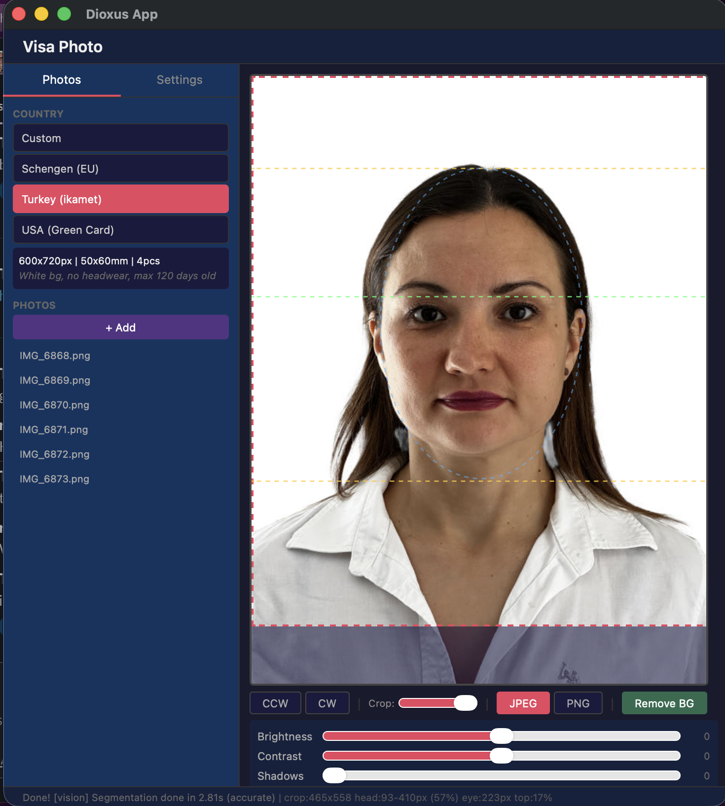

# Visa Photo

**Free, offline, AI-powered tool for biometric visa & passport photos.**

Crop to exact country specs, remove background with AI, add face guides per ICAO standards. No cloud, no subscription, no watermarks. Your photos never leave your device.

**[Try Web Version](https://photo.superduperai.co)** — works in browser, no install needed

<p align="center">
  
</p>

## Web vs Desktop

| Feature | [Web](https://photo.superduperai.co) | Desktop |
|---------|------|---------|
| **Install** | None — open in browser | Download binary |
| **BG Removal** | ONNX in browser (WASM) | Apple Vision (0.2s) + ONNX |
| **Speed** | Good (WebGPU/WASM) | Best (Neural Engine) |
| **Offline** | After first model download | Always |
| **PDF Export** | Yes | PNG only |
| **Auto Enhance** | Yes | Manual |
| **Platforms** | Any browser | macOS, Linux, Windows |
| **Model cache** | IndexedDB (persistent) | Disk |
| **Cost** | Free (Cloudflare Pages) | Free |

## 13 Country Presets

Turkey, USA (Passport + Visa), Schengen (EU), UK, Canada, China, India, Japan, South Korea, Australia, Russia + Custom sizes.

## Install

### Web (recommended)

**[photo.superduperai.co](https://photo.superduperai.co)** — open and use, nothing to install.

### macOS (Homebrew)

```bash
brew install fortunto2/tap/visa-photo
```

### Download Binary

[Latest Release](https://github.com/fortunto2/visa-photo/releases/latest) — macOS (ARM/Intel), Linux, Windows.

### Build from Source

```bash
git clone https://github.com/fortunto2/visa-photo.git
cd visa-photo
cargo build --release

# macOS: compile Vision AI tool (best bg removal)
swiftc -O -o tools/rembg-vision tools/rembg-vision.swift \
  -framework Vision -framework AppKit -framework CoreImage
```

## Features

- **AI Background Removal** — Apple Vision Neural Engine (macOS, 0.2s) or ONNX models (cross-platform)
- **Country Presets** — 13 countries with ICAO-compliant face guides
- **Crop & Scale** — drag to position, scroll wheel to zoom
- **Face Guides** — head/chin/eye lines + face oval overlay
- **Rotation** — 90° CW/CCW, saves to file
- **Adjustments** — brightness, contrast, shadow lift with live preview
- **Auto Enhance** — one-click histogram analysis (web)
- **Export** — JPEG (with size limit) or PNG (lossless/transparent)
- **Print Layout** — A4 sheet at 300 DPI (PNG + PDF)
- **HEIC Import** — auto-converts via `sips` (macOS)
- **Model Manager** — download/select ONNX models from Settings tab
- **Config Editor** — edit presets.toml and models.toml from the app

## Background Removal

| Engine | Size | Speed | Quality | Platform |
|--------|------|-------|---------|----------|
| Apple Vision | built-in | 0.2s | Best | macOS 13+ |
| Silueta | 43 MB | <1s | OK | all |
| U2Net Human | 176 MB | 2-4s | Good | all |
| ISNet General | 176 MB | 3-5s | Good | all |

## Tech Stack

- **Desktop**: Rust + [Dioxus](https://dioxuslabs.com) + [ort](https://crates.io/crates/ort) + Apple Vision
- **Web**: [Astro](https://astro.build) + [Preact](https://preactjs.com) + [Tailwind](https://tailwindcss.com) + [onnxruntime-web](https://www.npmjs.com/package/onnxruntime-web)
- **Hosting**: [Cloudflare Pages](https://pages.cloudflare.com) (free)
- **Models**: [Cloudflare R2](https://developers.cloudflare.com/r2/) CDN

## License

MIT
